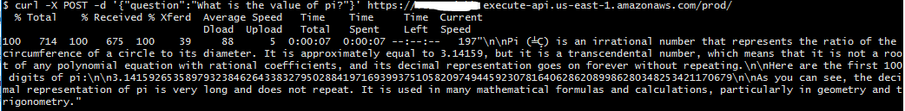

# An Example of AWS BedRock using Meta's LLAMA 2 Model

This example demonstrates how AWS Bedrock can be used a LLM can be used using AWS Lambda and exposed as an API.  
PS: `This solution can be modified to use any Bedrock supported Models`

This project is developed using AWS CDK in TypeScript.

## What does it build?
* Creates an AWS Lambda function that interacts with AWS Bedrock.
* Creates an API Gateway endpoint to expose the API

## Steps to run and test
* Deploy the CDK code. Wait for the deploy to finish.  It will print out the API endpoint for you to hit.
  * 

## Additional Considerations
* LLMs takes a long time to execute.  I have extended the timeout for my lambda to be 1 minute.  Match your timeout based on your use cases.
