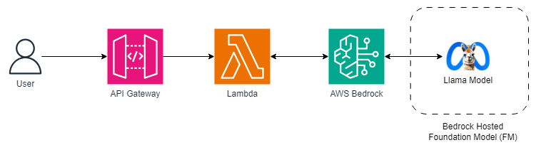

# An example of AWS Bedrock GenAI application using Meta's Llama 2 model

This example demonstrates how AWS Bedrock can be used for a LLM (llama2-13b) model using AWS Lambda and exposed as an API.  
PS: `This solution can be modified to use any Bedrock supported foundation models`

This project is developed using AWS CDK in TypeScript.

## Solution architecture - Serverless

## What does it build?
* Creates an AWS Lambda function that interacts with AWS Bedrock
* Uses Meta's  `llama2-13b` model
* Creates an AWS API Gateway endpoint to expose the API

## Steps to run and test
* Deploy the CDK code. Wait for the deploy to finish.  It will print out the API endpoint for you to use.
  * 

### Additional considerations
* LLMs take a long time to execute.  I have extended the timeout for the lambda to be 1 minute.  Match the timeout based on your usecase.

## References
* Learn about [AWS Bedrock](https://aws.amazon.com/bedrock/)
* AWS Bedrock [Foundation Models](https://docs.aws.amazon.com/bedrock/latest/userguide/models-supported.html)

